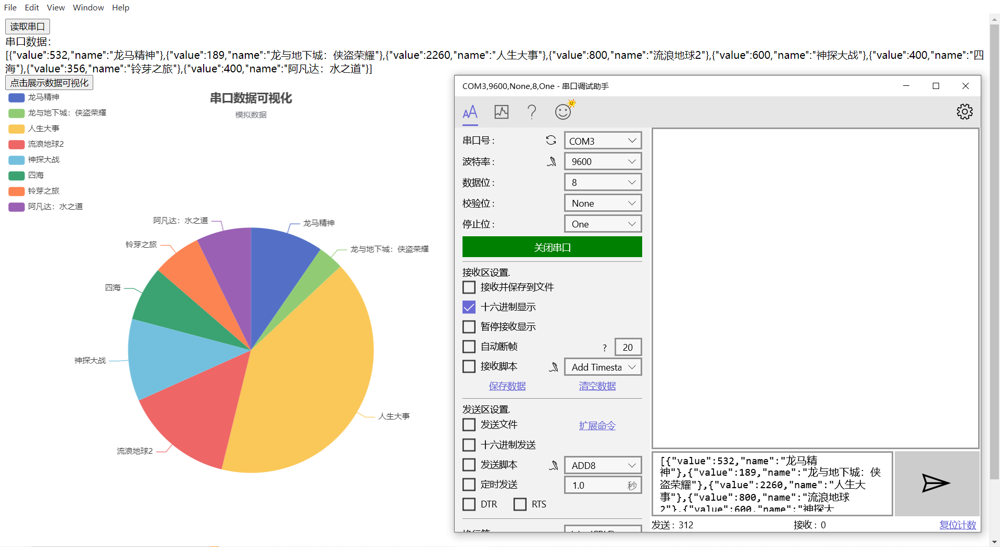

# Electron-Echarts-serialPort
 Electron，Echarts，serialPort练手项目

学习electron的串口通信知识，将数据传给前台进行可视化展示。

1.首先使用VSPD创建两个虚拟串口，COM2和COM3

2.下载串口调试助手，打开COM3

3.我并没有使用框架，而是原生的electron.25，serialPort监听的是COM2串口。

4.electron在github上的quick-start项目将项目的初步配置都装好了，以下是一个比较详细的介绍：https://blog.csdn.net/replayb/article/details/124125893

5.我用的是简单的serialPort代码，只要能实现串口数据接收就行。

6.需要注意的是，发送过来的数据是16进制数据，hex格式，所以需要进过两次数据转换，第一次转换成字符串，然后第二次转换成原本的JSON文件，以下是我发送的原版数据。

​	[{"value":532,"name":"龙马精神"},{"value":189,"name":"龙与地下城：侠盗荣耀"},{"value":2260,"name":"人生大事"},{"value":800,"name":"流浪地球2"},{"value":600,"name":"神探大战"},{"value":400,"name":"四海"},{"value":356,"name":"铃芽之旅"},{"value":400,"name":"阿凡达：水之道"}]

这是我之前一个项目的echarts的数据，=只要将它代替成option.series[0].data部分的数据，就可以实现饼状图的展示。

7.第一次转换使用的方法是我目前还在学习的，感觉很有用。第二次转换就很简单了，由于转换过的字符串不仅格式有问题，而且里面有大量的转义字符，好在保留了基本的JSON格式，直接使用JSON.parse(str)就能还原数据。

8.以下是开发版本的成果展示，如果需要最终版本，我这里的是npm run make，会生成out文件夹，里面有对应版本的桌面应用。

9.上传的文件，npm install下载所需依赖，就可以使用了；我会删除out文件夹，毕竟你可以随时自行生成，就不占用下载上传时间了。

